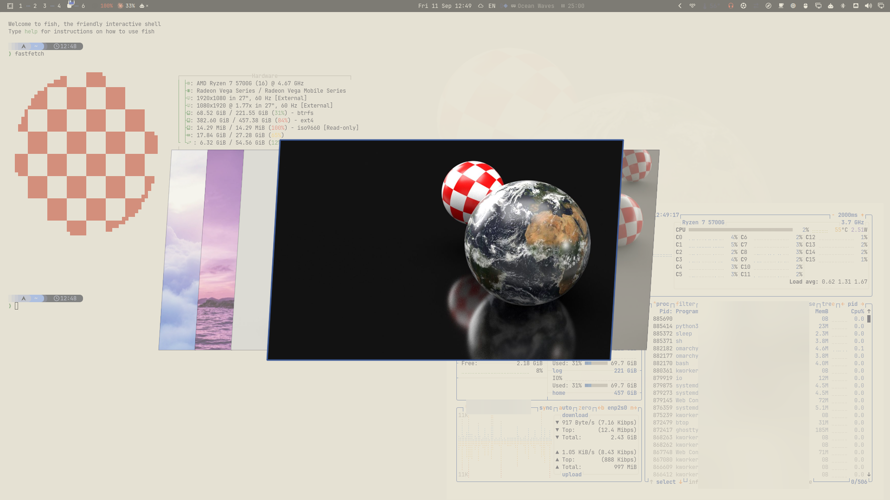
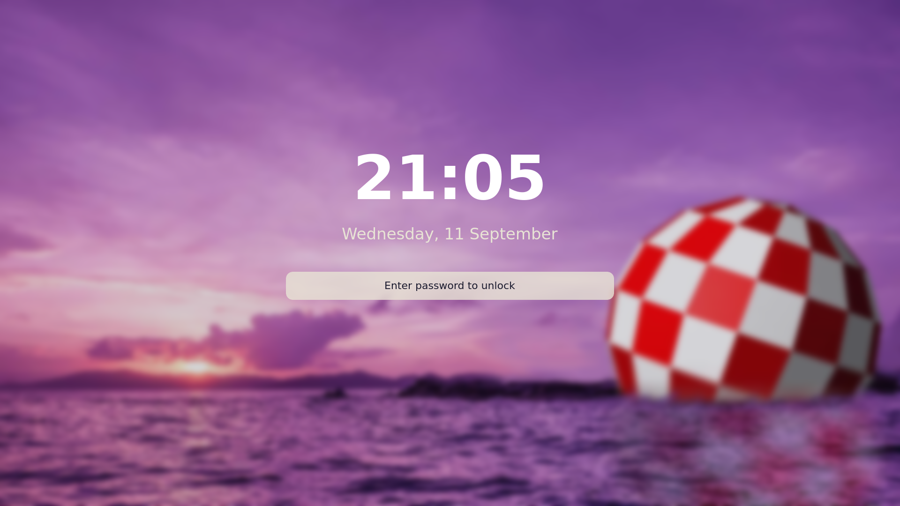

# AMIGO Quattro Theme for Omarchy

A theme for [Omarchy](https://omarchy.org/) inspired by AmigaOS 4's Wanderer
(Ambient) desktop — cream/beige window chrome, blue titlebars, and orange as
the secondary accent, with Boing Ball wallpapers.



<details>
<summary>Lock screen preview</summary>



</details>

## Install

```bash
omarchy theme install https://github.com/eddygarcas/omarchy-amigo-quattro-theme
omarchy theme set "AMIGO Quattro"
```

## Palette

| Role                | Color                                      |
|---------------------|---------------------------------------------|
| Accent (titlebar blue) | `#3D5A96` |
| Secondary accent (orange) | `#E8862E` |
| Background (window chrome) | `#E8E4D5` |
| Foreground (text) | `#1A1A2E` |
| Red   | `#C23B22` |
| Yellow | `#E0B23A` |
| Green | `#4C8C4A` |
| Cyan  | `#5B8FBE` |
| Blue  | `#3D5A96` |
| Magenta | `#8A5FB0` |

Full palette in [`colors.toml`](colors.toml). Terminal configs (Alacritty,
Foot, Kitty, Ghostty), Neovim, GTK, and the rest of the app theming are
generated automatically by Omarchy from `colors.toml` — this repo only ships
the theme-specific overrides: `colors.toml`, `hyprland.lua` (gradient window
border), `btop.theme`, `icons.theme` (`Yaru-blue`), and the backgrounds.

## Wallpapers

Five Boing Ball wallpapers, cycled with `omarchy theme bg next`. They're from
a third-party freeware pack, not original artwork — see
[`backgrounds/CREDITS.txt`](backgrounds/CREDITS.txt) for the source and the
creator's license statement, plus a licensing note below.

## Fastfetch logo

`about.txt` is a checkered-disc ASCII logo (generated with Omarchy's own
`omarchy-transcode-ascii`) evoking the Boing Ball, tinted red via
`config.jsonc`. Omarchy doesn't wire a theme's `about.txt`/`config.jsonc` up
automatically on `theme set` — apply it manually if you want it:

```bash
cp about.txt ~/.config/omarchy/branding/about.txt
cp config.jsonc ~/.config/fastfetch/config.jsonc
fastfetch
```

Revert anytime with `omarchy branding about reset` (and remove/restore your
own `~/.config/fastfetch/config.jsonc`).

## License

The theme configuration in this repo (`colors.toml`, `hyprland.lua`,
`btop.theme`, `icons.theme`, and the preview/lock-screen mockups) is
released under the [MIT License](LICENSE).

The wallpapers under `backgrounds/*.jpg` are **not** covered by that MIT
license. They come from a third-party freeware pack (see
[`backgrounds/CREDITS.txt`](backgrounds/CREDITS.txt)); the creator states
"these are freeware, and you can use them any way you like," while also
noting the Amiga brand and Boing Ball design remain the copyright of their
respective owners. If that ever becomes a problem for a particular
distribution channel, swap `backgrounds/*.jpg` for original artwork — the
license on everything else in this repo is unaffected.

AmigaOS and the Boing Ball are trademarks/copyrights of their respective
owners. AMIGO Quattro is an unofficial, fan-made color theme inspired by
AmigaOS 4 and is not affiliated with or endorsed by Hyperion Entertainment,
Amiga Inc., or any other AmigaOS rights holder.
